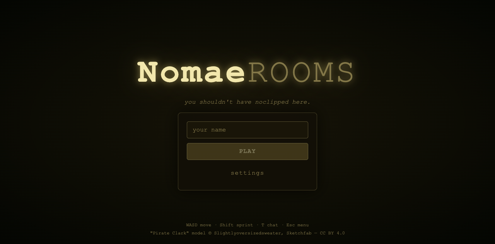

# NomaeROOMS

A multiplayer Backrooms horror game that runs entirely in your browser.
Get lost with friends. Watch out for **Pirate Clark**.

**Play it: https://testyee-09.github.io/nomaerooms/**



## How to play

- Click **PLAY** — everyone joins the same room automatically.
- No room codes, no accounts, no servers — pure WebSocket relay.
- Wander the infinite maze together. Proximity chat with **T**.
- Something tall walks these halls. It starts far away. It doesn't stay there.

| Key | Action |
| --- | --- |
| WASD | move |
| Mouse | look |
| Shift | sprint (watch your stamina) |
| T / Enter | open chat · Enter sends · Esc closes |
| Esc | pause menu |

Mobile: left half of the screen is a move stick, right half looks, with RUN/CHAT buttons.

## Tech

- **Three.js** — PBR materials with fully procedural textures (green damask wallpaper,
  damp carpet, ceiling tiles — painted on canvases at boot, with derived normal +
  roughness maps), ACES filmic tone mapping, dynamic shadow-casting fluorescents,
  and an EffectComposer stack: SSAO → bloom → film grain / vignette / chromatic
  aberration "dread" grade that intensifies as Clark closes in.
- **Infinite world** — deterministic chunked maze generated from a shared seed;
  every peer (and the AI) derives the identical layout from pure hash functions.
- **WebSocket relay** — every client connects to a central relay (Render). The host
  is authoritative over Clark; state streams at 12 Hz. Works on restricted NATs.
- **Pirate Clark** — A* pathfinding over the maze grid with escalating
  ROAM → STALK → CHASE states, line-of-sight checks, and a proximity jumpscare.
- **WebAudio** — every in-game sound (room tone, fluorescent buzz, footsteps,
  heartbeat, chase drone, the sting) is synthesized at runtime.

## Develop

```bash
npm install
npm run dev     # vite dev server
npm run build   # static build in dist/
```

Pushing to `main` auto-deploys to GitHub Pages via Actions.

## Credits

- "Pirate Clark" 3D model © [Slightlyoversizedsweater](https://sketchfab.com) — [CC BY 4.0](https://creativecommons.org/licenses/by/4.0/)
- Everything else © TESTYEE-09, MIT license.